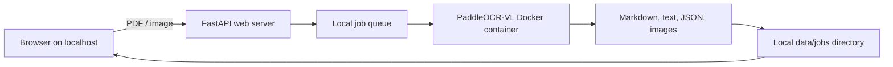

<div align="center">
  

  # PaddleOCR-VL Local Web UI

  **Turn PDFs and images into structured OCR results through a private, localhost-first interface.**

  [](https://github.com/egore4606/paddle-ocr-ui/actions/workflows/ci.yml)
  [](https://github.com/egore4606/paddle-ocr-ui/security/code-scanning)
  [](https://github.com/egore4606/paddle-ocr-ui/releases)
  [](LICENSE)
  [](https://www.python.org/)

  English · [Русский](docs/README.ru.md) · [Deutsch](docs/README.de.md)
</div>

---

PaddleOCR-VL Local Web UI is a small FastAPI application that queues OCR jobs and runs the official PaddleOCR-VL command inside Docker. Documents stay on your machine: uploads, logs, generated Markdown, JSON, text, and previews are stored below the local `data/` directory.

> [!IMPORTANT]
> This project is designed for a trusted local machine. It has no authentication. Keep the default `127.0.0.1` binding and do not expose it directly to the internet.

## Highlights

- Drag-and-drop PDF and image uploads.
- CPU or NVIDIA GPU inference.
- Background job queue with live logs and status history.
- Preview for Markdown, plain text, JSON, and images.
- One-click ZIP download for each job.
- Persistent PaddleOCR model caches between runs.
- No cloud upload or external database required.

## How it works



The Python server owns the queue and filesystem layout. Each job starts a short-lived container from the configured PaddleOCR-VL image. Only the job input, output directory, and local model caches are mounted into that container.

## Requirements

- Python 3.10 or newer
- Docker Desktop or Docker Engine
- Around 10 GB of free disk space for the OCR image and model cache
- For GPU mode: an NVIDIA GPU, current drivers, and NVIDIA Container Toolkit support

The default inference image is:

```text
ccr-2vdh3abv-pub.cnc.bj.baidubce.com/paddlepaddle/paddleocr-vl:latest-nvidia-gpu
```

## Quick start

### Windows PowerShell

```powershell
git clone https://github.com/egore4606/paddle-ocr-ui.git
cd paddle-ocr-ui
python -m venv .venv
.\.venv\Scripts\Activate.ps1
python -m pip install --upgrade pip
pip install -r server\requirements.txt
docker pull ccr-2vdh3abv-pub.cnc.bj.baidubce.com/paddlepaddle/paddleocr-vl:latest-nvidia-gpu
uvicorn server.app:app --host 127.0.0.1 --port 8000
```

### Linux and macOS

```bash
git clone https://github.com/egore4606/paddle-ocr-ui.git
cd paddle-ocr-ui
python3 -m venv .venv
source .venv/bin/activate
python -m pip install --upgrade pip
pip install -r server/requirements.txt
docker pull ccr-2vdh3abv-pub.cnc.bj.baidubce.com/paddlepaddle/paddleocr-vl:latest-nvidia-gpu
uvicorn server.app:app --host 127.0.0.1 --port 8000
```

Open [http://127.0.0.1:8000](http://127.0.0.1:8000), choose CPU or GPU, upload one or more supported files, and start the job. The first run can take a while because Docker and PaddleOCR download several gigabytes.

## Supported input

| Type | Extensions |
| --- | --- |
| Documents | `.pdf` |
| Images | `.png`, `.jpg`, `.jpeg`, `.bmp`, `.tif`, `.tiff`, `.webp` |

Results are written to `data/jobs/<job-id>/output/`. The entire `data/` directory is ignored by Git and should be treated as private because OCR results can contain sensitive document content.

## Configuration and operation

The current release intentionally keeps configuration small:

- the PaddleOCR-VL v1 pipeline is used for every job;
- GPU is the default device, with CPU available in the UI;
- model caches live in `~/.paddleocr-vl-cache`;
- application data lives in the repository's `data/` directory.

See [Architecture](docs/ARCHITECTURE.md) for implementation details and [Troubleshooting](docs/TROUBLESHOOTING.md) for Docker, GPU, startup, and cache problems.

## Development

```bash
python -m venv .venv
source .venv/bin/activate  # Windows: .\.venv\Scripts\Activate.ps1
pip install -r requirements-dev.txt
ruff check .
pip-audit -r server/requirements.txt
python -m compileall server
node --check web/app.js
pytest --cov=server --cov-report=term-missing
```

Docker is not required for the unit test suite. See [CONTRIBUTING.md](CONTRIBUTING.md) before opening a pull request.

## Security

Uploads and OCR output may contain confidential information. Do not commit `data/`, `.env`, logs, or model cache files. If you discover a vulnerability, use GitHub's [private vulnerability reporting](https://github.com/egore4606/paddle-ocr-ui/security/advisories/new) instead of opening a public issue. See [SECURITY.md](SECURITY.md).

## Roadmap

- Job cancellation and cleanup controls
- Configurable storage and upload limits
- More export formats
- Better progress reporting from the inference container
- Optional authentication for deliberate network deployments

Ideas and questions are welcome in [Discussions](https://github.com/egore4606/paddle-ocr-ui/discussions).

## License

Released under the [MIT License](LICENSE). PaddleOCR and the referenced container image are separate projects with their own licenses and terms.
