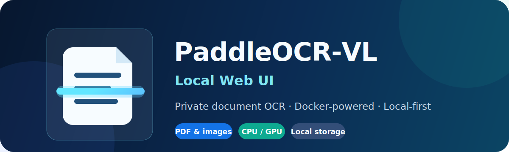

<div align="center">
  

  # PaddleOCR-VL Local Web UI

  **Lokale Texterkennung für PDFs und Bilder über eine übersichtliche Weboberfläche.**

  [English](../README.md) · [Русский](README.ru.md) · Deutsch
</div>

---

PaddleOCR-VL Local Web UI ist eine kleine FastAPI-Anwendung, die OCR-Aufträge verwaltet und PaddleOCR-VL in Docker ausführt. Dokumente werden nicht in eine Cloud hochgeladen: Eingaben, Protokolle und Ergebnisse bleiben im lokalen Verzeichnis `data/`.

> [!IMPORTANT]
> Die Anwendung besitzt keine Anmeldung. Sie ist für einen vertrauenswürdigen Rechner und die Bindung an `127.0.0.1` gedacht. Stelle sie nicht direkt ins Internet.

## Funktionen

- PDFs und Bilder per Drag-and-drop hochladen
- Verarbeitung auf CPU oder NVIDIA-GPU
- Hintergrundwarteschlange mit Live-Protokollen
- Vorschau für Markdown, Text, JSON und Bilder
- Ergebnisse eines Auftrags als ZIP herunterladen
- Lokaler Modellcache über mehrere Starts hinweg

## Voraussetzungen

- Python 3.10 oder neuer
- Docker Desktop oder Docker Engine
- ungefähr 10 GB freier Speicher für Image und Modelle
- für GPU-Betrieb: NVIDIA-GPU, aktueller Treiber und NVIDIA Container Toolkit

## Schnellstart

```bash
git clone https://github.com/egore4606/paddle-ocr-ui.git
cd paddle-ocr-ui
python3 -m venv .venv
source .venv/bin/activate
python -m pip install --upgrade pip
pip install -r server/requirements.txt
docker pull ccr-2vdh3abv-pub.cnc.bj.baidubce.com/paddlepaddle/paddleocr-vl:latest-nvidia-gpu
uvicorn server.app:app --host 127.0.0.1 --port 8000
```

Öffne [http://127.0.0.1:8000](http://127.0.0.1:8000), wähle CPU oder GPU, füge Dateien hinzu und starte den Auftrag. Beim ersten Start werden mehrere Gigabyte an Docker- und Modelldaten geladen.

Unterstützt werden `.pdf`, `.png`, `.jpg`, `.jpeg`, `.bmp`, `.tif`, `.tiff` und `.webp`. Ergebnisse landen unter `data/jobs/<auftrags-id>/output/`.

Weitere Informationen: [Architektur](ARCHITECTURE.md), [Fehlerbehebung](TROUBLESHOOTING.md), [Mitwirken](../CONTRIBUTING.md) und [Sicherheit](../SECURITY.md).

Fragen und Ideen gehören in die [Discussions](https://github.com/egore4606/paddle-ocr-ui/discussions). Sicherheitslücken bitte ausschließlich [privat melden](https://github.com/egore4606/paddle-ocr-ui/security/advisories/new).

Veröffentlicht unter der [MIT-Lizenz](../LICENSE). PaddleOCR und das verwendete Container-Image sind eigenständige Projekte mit eigenen Lizenzbedingungen.
